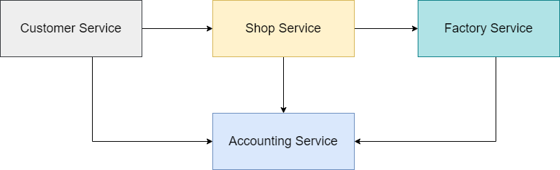

# E-Shop

### System Operations

System implements the following system operations

#### User operations
1. As a **User** I want to create **Customer** with *banking account*, *initial balance* and *product needs*.
2. As a __User__ I want to create __Shop__ with __Stock__ with initial amount of __Product__. __Shop__ will have __Banking account__ with _initial balance_.
3. As a __User__ I want to create __Factory__ which will produce __Products__ using _unit of time_.

#### Customer operations
1. As a **Customer** I want to make an **Order**. 
2. As a **Shop** I want to accept an **Order**.

### High Level Domain Model

